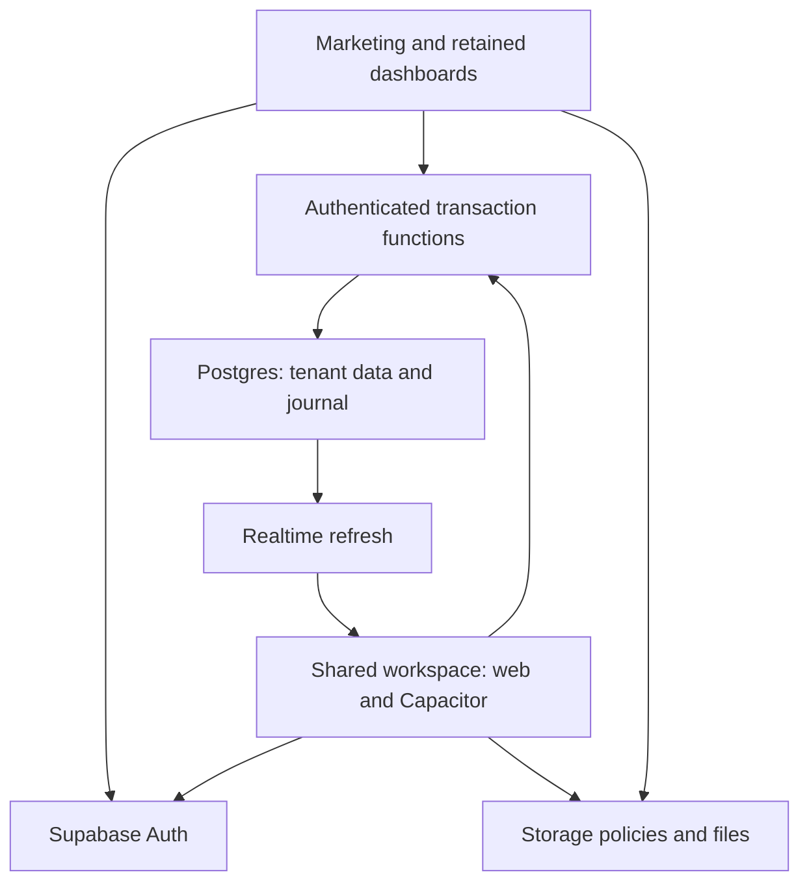

# V2 architecture and scope

## Baseline and decision

Main at `b592891508ee47f31e42bd30668673a951492707` is a static HTML/JavaScript product over Supabase Auth, Postgres, Storage and Realtime. The owner, manager and rep dashboards contain extensive operational workflows. The alternate Next.js migration branch is separate work; it is not assumed deployed. V2 retains the functioning dashboards and adds a shared, maintainable workspace rather than replacing their whole business model.

The existing mobile project uses Next.js static export and Capacitor 7. It now contains dedicated phone workflows, a fixed bottom navigation, touch controls, a native camera scanner and native lifecycle locking. This avoids a second UI stack and divergent transaction rules. Capacitor still renders local web assets in a native webview; this is an explicit architecture choice, not a claim of React Native or native widgets. Core operations no longer open the remote website. Advanced unported operations deliberately open the retained web role dashboard.

## Boundaries

The browser/native UI is untrusted. Public anon credentials identify a client, not a privileged user. Every new transaction function reads the active profile via `auth.uid()`, obtains its tenant, checks the business status and role, and validates related records. Private helper functions use an empty search path and have no direct authenticated/anonymous grants. Database RLS and Storage policies remain essential for all direct reads and retained writers. New functions alone do not close existing direct mutation grants.

## Source of truth

| Entity | Current source | V2 behavior |
| --- | --- | --- |
| Business identity | `tenants`, authoritative `profiles` | One business per profile; no invented business switcher |
| Warehouse quantity | `products.warehouse_stock` | Locked relative changes; opening journal plus deltas must reconcile |
| Rep stock and dispatch debt | `rep_holdings` | Separate quantity/debt; sales reduce quantity without charging dispatch debt twice |
| Sale | `sales` plus `sale_items` | One transaction; server totals and cost snapshots; explicit stock source on new sales |
| Payment collection | Existing `payments`/confirmation flows | Recorded evidence and debt allocation; no gateway charge or bank refund |
| Purchase receiving | `inventory_receipts`, items, suppliers | Business-scoped normalized invoice identity, row locks and replay body checking |
| Activity | `stockflow_movements`, `stockflow_audit` | Clients may read only authorised records; no client mutation grants |
| Profit | Recognised sale headers/items and cost snapshots | Estimated gross profit; missing snapshots produce an unavailable figure, not zero cost |

The journal starts with **V2 opening balances**. It does not manufacture historical movements. New sale cancellations restore the known source once and record that no monetary refund occurred. A historical sale without a reliable source is refused until reconciled.

Recognised sales are `completed`, `confirmed` and `approved`. `pending`, `edited` and `edit_pending` are separately awaiting review. Cancelled/rejected records do not contribute to recognised revenue. Reporting days use Africa/Lagos and contain zero-sales dates. Reports are aggregated on the server; list pagination never defines the report total.

## Intended permissions of new APIs

| Operation | Owner | Manager | Rep | Platform super-admin |
| --- | --- | --- | --- | --- |
| Business overview | Own business | Own business | Own sales | Separate retained admin interface |
| Warehouse POS | Yes | Yes | No | No business bypass |
| Rep sale | No implicit impersonation | No implicit impersonation | Own holdings, pending credit workflow | No business bypass |
| Product create/edit/import | Yes | Not in new product API; retained manager forms need a reviewed port | No | Separate admin scope |
| Warehouse stock adjustment | Yes | Yes | No | No business bypass |
| Dispatch/receiving | Yes | Yes, same business | No | No business bypass |
| Cancel new sale | Own business | Own business | Own pending/edited sale | No business bypass |
| Customers | Own business | Own business | Own business, as existing model allows | Separate admin scope |
| Movement history | Own business | Own business | Own allocated-stock movements | Separate admin scope |
| Sensitive audit | Own business | Own business | No | Separate admin scope |
| Invite manager/rep | Trusted owner invitation | No | No | Separate admin scope |

This matrix is the staged API policy. Retained manager product creation, price proposals, payment edits, returns and purchase-order receiving need explicit migration/permission reconciliation before table writes can be revoked. A branch label on a profile does not imply branch inventory or branch security.

## Retry, offline and sync

Checkout first records an actor-scoped request intent. The server serializes its tenant/actor/request key and compares the exact payload. A response lost after commit can be retrieved using that key; a changed payload cannot reuse it. Stock locks are taken in stable product order. Receiving serializes a normalized tenant/invoice identity and returns the original receipt only for the same inventory payload. Reuploading an attachment does not add stock twice.

Offline finalisation is disabled. There is no automatic offline sale sync queue, eventual overselling policy or invented conflict resolver. Realtime refresh, focus/reconnect refresh and explicit reload all read the same backend; production publication settings and real device-to-web latency must still be checked.

Native auth tokens are memory-only; browser workspace tokens use tab-scoped session storage. Backgrounding the native app and five minutes of inactivity require password unlock. Unlock rereads profile/tenant without reloading the native webview. This is local privacy protection, not a replacement for short token expiry, refresh revocation or device-loss response. Biometrics and persistent secure native storage are deferred until device QA. No credentials are sent through dashboard handoff URLs.

## Scale and deployment

Product and sales lists request 20 rows plus a next-page sentinel; search is debounced and stale requests are aborted. Tenant/date, product browse, receipt line and trigram search indexes support the implemented query paths. Deep offset pagination, broad one-character searches and full-period aggregate scans still require production profiling. Ten thousand businesses or millions of sales have not been load-certified.

Vercel/Netlify build a static package containing the marketing website, existing role pages and `/workspace`. No runtime Next server, server actions or automatic SQL migration runs in that package. CI tests an isolated inferred schema, real PostgreSQL terminal races, UI flows, website routing, Android debug and iOS simulator builds. Every native binary must be built from the native export and actual target environment; store signing is never inferred from a debug artifact.

## Planned later, not shipping claims

Real branch tables/permissions/transfers, variants, category hierarchy, split payments, payment-provider charging/refunds, offline finalised sales, push delivery and an authoritative customer credit ledger require their own data/provider work. Staff invitation is staged through an owner-authenticated Edge Function; real Auth/email delivery and compatibility with the older missing-source `provision-user` endpoint must be verified. Existing supplier orders, expenses and staff screens are preserved, but their migration and live regression are incomplete. The website marks V2 images as previews and native store availability as pending.
